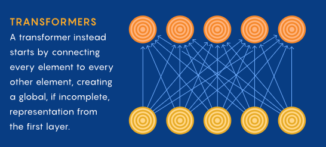

</img>

*<a href="https://d2l.ai/chapter_attention-mechanisms/self-attention-and-positional-encoding.html">Dive into Deep Learning</a>, redone by Quanta Magazine*

## Attention (wip)

This repository will house a visualization that will attempt to convey instant enlightenment of how <a href="https://www.quantamagazine.org/will-transformers-take-over-artificial-intelligence-20220310/">Attention</a> works, in the field of artificial intelligence. Obviously I believe this algorithm to be one of the most important developments in the history of deep learning. We can possibly use it to solve, well, everything.

In my mind, one good intuitive visualization can bring about more insight and understanding than long highly paid tutoring / courses.

## Why does it work?

Attention has many interpretations, ranging from <a href="https://mcbal.github.io/post/an-energy-based-perspective-on-attention-mechanisms-in-transformers/">physics based intepretations</a> to <a href="https://www.youtube.com/watch?v=THIIk7LR9_8">speculations on biological plausibility</a>.

Update: Recently, three papers have concurrently closed in on a connection between self-attention and gradient descent, while investigating in-context learning properties of Transformers!

1. <a href="https://arxiv.org/abs/2212.07677">Transformers learn in-context by gradient descent</a>
2. <a href="https://arxiv.org/abs/2211.15661">What learning algorithm is in-context learning? Investigations with linear models</a>
3. <a href="https://arxiv.org/abs/2212.10559v2">Why Can GPT Learn In-Context? Language Models Secretly Perform Gradient Descent as Meta-Optimizers</a>

## What has Attention accomplished?

- [Protein Folding](https://www.nature.com/articles/s41586-021-03819-2)
- [Language](https://arxiv.org/abs/2005.14165)
- [Vision](https://arxiv.org/abs/2010.11929)
- [Image Segmentation](https://arxiv.org/abs/2005.12872)
- [Speech Recognition](https://arxiv.org/abs/2203.15095)
- [Symbolic Mathematics](https://arxiv.org/abs/1912.01412)
- [Midi Generation](https://openai.com/blog/musenet/)
- [Theorem Proving](https://arxiv.org/abs/2009.03393)
- [Gene Expression](https://www.nature.com/articles/s41592-021-01252-x)
- [Text to Image](https://openai.com/blog/dall-e/)
- [Attention-only Text to Image](https://parti.research.google/)
- [Text to Video](https://arxiv.org/abs/2111.12417)
- [Text to Video 2](https://github.com/THUDM/CogVideo)
- [Code Generation](https://www.deepmind.com/blog/competitive-programming-with-alphacode)
- [Language+](https://arxiv.org/abs/2204.02311)
- [Protein Generation](https://arxiv.org/abs/2004.03497)
- [Multimodal Model](https://arxiv.org/abs/2111.12993)
- [Video Understanding](https://ai.facebook.com/blog/timesformer-a-new-architecture-for-video-understanding/)
- [Heart Disease Classification](https://bmcmedinformdecismak.biomedcentral.com/articles/10.1186/s12911-021-01546-2)
- [Weather Forecasting](https://ai.googleblog.com/2020/03/a-neural-weather-model-for-eight-hour.html)
- [Text to Speech](https://github.com/neonbjb/tortoise-tts)
- [Few-Shot Visual Question Answering](https://www.deepmind.com/blog/tackling-multiple-tasks-with-a-single-visual-language-model)
- [Generalist Agent](https://www.deepmind.com/publications/a-generalist-agent)
- [Audio Generation from Raw Waveform](https://arxiv.org/abs/2206.08297)
- [Sample Efficient World Model](https://arxiv.org/abs/2209.00588)
- [Audio / Speech Generation](https://google-research.github.io/seanet/audiolm/examples/)
- [Nucleic Acid / Protein Binding](https://www.biorxiv.org/content/10.1101/2022.09.09.507333v1)
- [Generalizable Prompting for Robotic Arm Control](https://twitter.com/DrJimFan/status/1578433493561769984)
- [Zero-shot Text to Speech](https://valle-demo.github.io/)
- [Music Generation](https://google-research.github.io/seanet/musiclm/examples/)
- [Designing Molecular Scissors for DNA](https://www.nature.com/articles/s41587-022-01624-4)
- [Nucleic Language Model](https://www.biorxiv.org/content/10.1101/2023.01.11.523679v1)

Will keep adding to this list as time goes on

## Other resources

- [Yannic Kilcher](https://www.youtube.com/watch?v=iDulhoQ2pro)
- [Peter Bloem](http://peterbloem.nl/blog/transformers)
- [Jay Alammar](http://jalammar.github.io/illustrated-transformer/)
- [Sasha Rush](https://nlp.seas.harvard.edu/2018/04/03/attention.html)
- [Lilian Weng](https://lilianweng.github.io/posts/2018-06-24-attention/)
- [CodeEmporium](https://www.youtube.com/watch?v=HQn1QKQYXVg)

## Is it all we need?

No one really knows. All I know is, if we were to dethrone attention with a better algorithm, it is over. Part of what motivates me to do some scalable 21st century teaching is the hope maybe someone can find a way to improve on it, or find its replacement. It just takes one discovery!

## Potential improvements

- [Simplicial Hopfield networks](https://openreview.net/forum?id=_QLsH8gatwx)

## Appreciation

Large thanks goes to <a href="https://www.youtube.com/channel/UCYO_jab_esuFRV4b17AJtAw">3Blue1Brown</a> for showing us that complex mathematics can be taught with such elegance and potency through visualizations

## Citations

```bibtex
@misc{vaswani2017attention,
    title   = {Attention Is All You Need},
    author  = {Ashish Vaswani and Noam Shazeer and Niki Parmar and Jakob Uszkoreit and Llion Jones and Aidan N. Gomez and Lukasz Kaiser and Illia Polosukhin},
    year    = {2017},
    eprint  = {1706.03762},
    archivePrefix = {arXiv},
    primaryClass = {cs.CL}
}
```

```bibtex
@article{Bahdanau2015NeuralMT,
    title   = {Neural Machine Translation by Jointly Learning to Align and Translate},
    author  = {Dzmitry Bahdanau and Kyunghyun Cho and Yoshua Bengio},
    journal = {CoRR},
    year    = {2015},
    volume  = {abs/1409.0473}
}
```

*Gotta teach the AGI to love.* - Ilya Sutskever [♥](https://www.youtube.com/watch?v=GUo2XuqMcCU)
